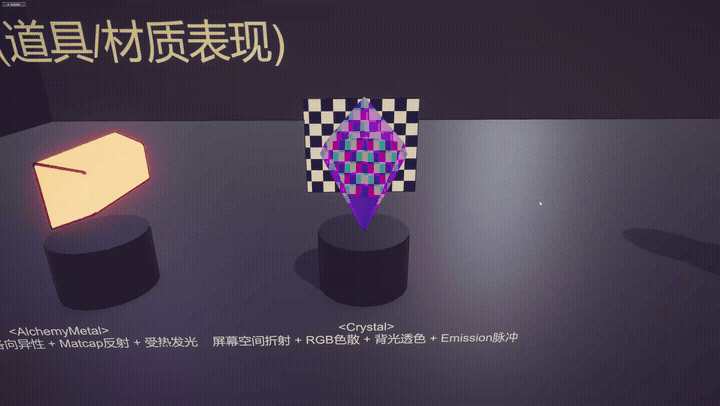
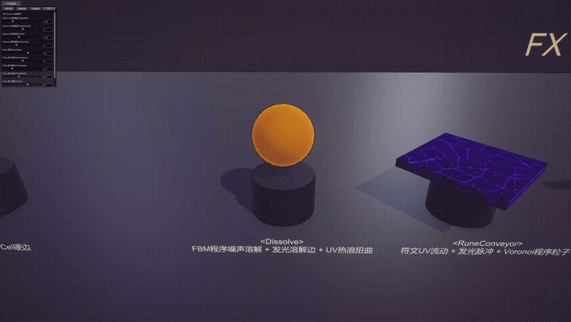

# Gourmet-Line · Unity URP NPR 渲染与 TA 工具链实践

> 基于 **Unity URP** 的技术美术实践项目。项目最初以《莱莎的炼金工房》风格的二次元中世纪炼金工房为视觉目标，完成了 NPR Shader、屏幕空间描边、后处理调色与 Houdini VAT 接入。  
> 当前版本除展示渲染/特效效果外，也重点整理 **Shader 展示、运行时参数驱动、VAT 资源接入、Build 踩坑与后续工具链扩展**，作为从“渲染表现 TA”向“Unity 工具链 / 程序化 / 性能优化 TA”转型的阶段性作品集。

<!-- 顶部主图：整体展示场景 GIF/视频 -->


---

## 项目定位

这个项目不是单纯的 Shader 效果合集，而是围绕 **Unity TA 效果落地流程** 的综合实践：

1. **渲染表现基础**：完成 8 个 HLSL / ShaderLab 自定义 Shader，覆盖道具、环境、动态特效与 VAT 流体。
2. **URP 管线实践**：接入 Renderer Feature、DepthNormals Pass、屏幕空间描边与后处理调色。
3. **DCC → Unity 资源接入**：完成 Houdini VAT 流体导出与 Unity GPU 播放，整理数据贴图导入规则。
4. **运行时参数驱动**：用 C# 驱动溶解、流动、发光、描边等参数，支持展示和调试。
5. **工具链转向计划**：后续补充 VAT 资源检查、材质批量编辑、性能优化案例与程序化生成工具。

---

## 当前状态

| 模块 | 状态 | 说明 |
|---|---|---|
| NPR Shader 库 | ✅ 已完成 | 8 个自定义 Shader，覆盖角色/道具、环境、特效 |
| Screen-Space Outline | ✅ 已完成 | URP Renderer Feature + Depth / Normal 边缘检测 |
| Post Processing | ✅ 已完成 | Bloom、Tonemapping、Lift/Gamma/Gain、Vignette |
| Houdini VAT Pipe Fluid | ✅ 已完成 | Houdini 流体 → VAT 烘焙 → Unity GPU 播放 |
| 运行时参数驱动 | ✅ 已完成 | C# 驱动溶解、流动、发光等动态参数 |
| Showcase 展示场景 | ✅ 已完成 | 用于集中展示材质、VAT、描边、后处理效果 |
| VAT Texture Import Checker | 🔜 计划中 | 检查 sRGB、MipMap、Filter Mode、Compression 等导入设置 |
| Material Batch Editor | 🔜 计划中 | 批量修改材质描边、Emission、Rim、Ramp 等参数 |
| Performance Report | 🔜 计划中 | 用 Profiler 分析 GC、材质实例化、对象池与 UI/DrawCall 问题 |
| Procedural Generator | 🔜 计划中 | 程序化地图 / 管道 / 场景装饰生成工具 |

---

## 项目概览

- **引擎 / 管线**：Unity 2022 LTS · URP 14
- **渲染实现**：HLSL · ShaderLab 多 Pass · Shader Graph 辅助
- **核心效果**：Ramp/Cel Shading、Rim Light、Clip-Space Outline、Screen-Space Outline、Matcap、Fresnel、屏幕空间折射/色散、Triplanar、Dissolve、VAT
- **工程实践**：C# 运行时参数驱动、Shader Showcase 展示场景、VAT 导入设置整理、Build 问题记录
- **DCC 流程**：Houdini 流体仿真 → VAT 烘焙 → Unity GPU 重建播放
- **后续方向**：Unity Editor 工具、资源检查、材质批处理、性能优化、程序化内容生成

---

## 三层 NPR 架构

```text
┌───────────────────────────────────────────────┐
│        Gourmet-Line NPR Rendering Pipeline     │
├───────────────────────────────────────────────┤
│ 屏幕层：Post Processing                         │
│ Bloom / Tonemapping / Lift-Gamma-Gain / Vignette│
├───────────────────────────────────────────────┤
│ 管线层：URP Renderer Feature                    │
│ Screen-Space Outline / DepthNormals Pass        │
├───────────────────────────────────────────────┤
│ 物体层：HLSL Shader Library                     │
│ Cel / Metal / Crystal / Dissolve / Rune / Env   │
└───────────────────────────────────────────────┘
```

---

## 一、道具 / 材质表现

### AnimeFood — 卡通角色 / 食物基础材质

二次元角色/食物的基础卡通材质，用于统一全场景的光照语言。

**实现要点**

- Ramp Shadow：使用 `smoothstep` 控制明暗边界宽度，再通过 `step` 保持卡通硬边。
- Rim Light：基于视线方向和法线夹角增强轮廓区域亮度。
- Cel Specular：对 Blinn-Phong 高光结果做硬边化处理。
- Clip-Space Outline：在裁剪空间沿法线方向膨胀顶点，实现近似像素恒宽的物体级描边。

---

### AlchemyMetal — 炼金金属


用于炼金炉、大锅、管件等金属部件，表现铸铁拉丝质感与炉底受热发光。

**实现要点**

- Kajiya-Kay 风格各向异性高光：基于切线方向控制拉丝高光走向。
- Matcap 风格化反射：使用视角空间法线采样 Matcap，增强二次元金属表现。
- 顶点色磨损：使用顶点色控制边缘/局部磨损区域。
- World-Y 受热 Emission：用世界空间高度控制炉底发光渐变。

---

### Crystal — 晶体 / 宝石



炼金原料宝石，强调折射、色散、背光透色与内部辉光。

**实现要点**

- Screen-Space Refraction：采样 `_CameraOpaqueTexture`，通过法线扰动 UV 产生折射感。
- RGB Dispersion：对 RGB 三通道使用不同偏移，模拟棱镜彩边。
- Fresnel：控制边缘和中心的透明/发光差异。
- Emission Pulse：用 `sin(_Time)` 控制内部辉光脉冲。

---

## 二、环境材质

### StoneFloor — 石板地面


工房地面/墙壁材质，使用三平面映射减少 UV 依赖。

**实现要点**

- Triplanar Mapping：按法线权重混合三轴投影，减少拉伸和接缝。
- 顶点色苔藓 Mask：使用顶点色 G 通道控制苔藓覆盖区域。
- 湿润高光：对裸石区域增加较低强度高光。

---

### Wood — 木材


用于木架、木箱等道具，采用暖木冷影的卡通冷暖分离。

**实现要点**

- Detail Normal：叠加木纹细节法线。
- Cool/Warm Shading：阴影偏冷紫棕，亮部偏暖黄。
- 弱各向异性高光：沿木纹方向增加轻微高光。

---

### Fabric — 布料


用于材料袋、布料道具，表现双向纤维交织的织物光泽。

**实现要点**

- Warp / Weft 双层各向异性高光。
- 经线沿切线，纬线沿副切线分别计算后叠加。
- 使用 `step` 保持与整体 Cel 风格一致。

---

## 三、特效 / 动态表现

### Dissolve — 溶解 / 炼金反应



用于原料投入炼金炉时的溶解消失效果，包含发光溶解边与热浪扭曲。

**实现要点**

- FBM 程序化噪声：3 层梯度噪声叠加作为溶解 Mask。
- `clip()` 溶解：根据 `_DissolveAmount` 裁切像素。
- 发光溶解边：根据阈值附近区域生成 Hot/Cool 双色 Emission。
- ShadowCaster 同步裁切：避免物体溶解后仍保留完整阴影。
- C# 参数驱动：运行时循环修改 `_DissolveAmount`。

---

### RuneConveyor — 魔法符文传送带


炼金工房中的流动符文阵与魔法粒子效果。

**实现要点**

- 符文 UV 定向流动。
- `sin(_Time)` 全局呼吸脉冲。
- Voronoi 程序化粒子：不依赖 Particle System，为每个细胞生成独立闪烁相位。
- 无贴图时自动切换到 Voronoi 边缘线作为程序符文阵。

---

## 四、Houdini 流体仿真 · VAT

### Pipe Fluid — 管道流体 Vertex Animation Texture


在 Houdini 中模拟管道内流体，通过 VAT 烘焙后在 Unity 中由 GPU 重建播放，展示 DCC 仿真到引擎落地的完整流程。

**实现流程**

1. Houdini 中完成管道流体模拟。
2. 使用 SideFX Labs / GameDev VAT 导出 `pos`、`rot`、`lookup`、`col` 数据贴图。
3. Unity 中导入 EXR 数据贴图，并关闭不适合数据贴图的选项。
4. Shader 根据 VertexID 和时间采样 VAT 贴图，在顶点阶段重建动画。
5. C# 控制播放帧范围，实现循环播放或一次性播放。

**接入踩坑记录**

- `pos` / `rot` / `lookup` 数据贴图不应按普通颜色贴图处理。
- 数据贴图需重点检查 `sRGB`、`MipMap`、Compression、Filter Mode。
- Vertex Compression 可能导致顶点数据精度问题。
- VAT 动画包围盒可能导致视锥剔除异常，需要扩展 Bounds。
- Build 时仅通过 `Shader.Find` 引用的 Hidden Shader 可能被剔除，需要加入 Always Included Shaders 或显式引用。

---

## 五、管线级 NPR

### Screen-Space Outline — 全屏风格化描边


基于 URP Renderer Feature 实现屏幕空间描边，作为物体级 Clip-Space Outline 的补充。

**实现要点**

- 采样 `_CameraDepthTexture` 和 `_CameraNormalsTexture`。
- 比较相邻像素的深度 / 法线差异来检测边缘。
- 补充物体交界、内部折角等物体级描边难以覆盖的区域。
- 为自定义 Shader 补充 DepthNormals Pass，避免全局描边缺失。

### Post Processing — 屏幕级调色

- Bloom：Emission > 1 的区域触发发光。
- Tonemapping：控制整体明暗映射。
- Lift/Gamma/Gain：阴影偏冷、高光偏暖，强化炼金工房氛围。
- Vignette：增强画面中心聚焦。

---

## 六、运行时驱动与展示流程

项目中不仅实现静态材质，也用 C# 驱动 Shader 参数，便于调试和展示。

**已有实践**

- `_DissolveAmount`：控制溶解进度。
- `_EmissionIntensity`：控制发光强度。
- `_OutlineWidth`：控制描边宽度。
- VAT 播放参数：控制当前帧、循环区间、播放速度。
- Showcase 场景：集中展示 Shader、VAT、描边和后处理效果。

**后续优化方向**

- 使用 `MaterialPropertyBlock` 替代频繁访问 `Renderer.material`，避免运行时隐式实例化材质。
- 封装统一的 `ShaderParamDriver`，让不同材质效果共用参数驱动逻辑。
- 为录制/调试提供统一的 Editor 面板。

---

## 七、Tooling Prototype 计划

当前作品集已有渲染表现基础，下一步重点补充 Unity Editor 工具，让项目从“效果展示”进一步转向“工程型 TA”。

### 1. VAT Texture Import Checker

**目标**：检查 VAT 数据贴图导入设置，减少因为资源设置错误导致的运行时表现异常。

**计划检查项**

- `TextureImporter.sRGBTexture`
- `TextureImporter.mipmapEnabled`
- `TextureImporter.textureCompression`
- `TextureImporter.filterMode`
- 命名规则：`*_pos`、`*_rot`、`*_lookup`、`*_col`
- 数据贴图格式：EXR / HDR / 非普通颜色贴图

**计划使用 API**

- `EditorWindow`
- `AssetDatabase.FindAssets`
- `AssetDatabase.GUIDToAssetPath`
- `AssetImporter.GetAtPath`
- `TextureImporter`
- `Selection.activeObject`
- `EditorGUILayout`

---

### 2. Material Batch Editor

**目标**：批量管理 NPR 材质参数，提高场景调色与效果迭代效率。

**计划功能**

- 按 Shader 名称筛选 Material。
- 批量修改 `_OutlineWidth`、`_RimPower`、`_EmissionIntensity` 等参数。
- 批量替换 Shader。
- 保存常用风格预设。

**计划使用 API**

- `Material.HasProperty`
- `Material.SetFloat`
- `Material.SetColor`
- `Shader.Find`
- `AssetDatabase.FindAssets("t:Material")`
- `EditorUtility.SetDirty`
- `AssetDatabase.SaveAssets`

---

### 3. Performance Case Study

**目标**：用实际项目记录性能分析和优化过程，而不是只写“了解优化”。

**计划分析点**

- `Renderer.material` 导致材质实例化。
- 运行时频繁 `Instantiate / Destroy`。
- UI 或参数面板产生 GC Alloc。
- 可复用对象接入对象池。
- 使用 `MaterialPropertyBlock` 驱动单物体参数变化。

**计划使用工具 / API**

- Unity Profiler
- Memory Profiler 可选
- `MaterialPropertyBlock`
- `ObjectPool<T>` 或自定义对象池
- `ProfilerMarker` 可选

---

### 4. Procedural Generator

**目标**：补充程序化 TA 方向的可视化作品，让作品集不仅有 Shader，也有参数化内容生成能力。

**可选方向**

- Unity Roguelike 地图生成器：房间、路径、节点、随机种子、连通性校验。
- Houdini 程序化管道网络：曲线生成管道、接口、阀门、材质分组。
- Unity 场景装饰散布工具：区域 Mask、密度、随机旋转缩放、碰撞检测。

---

## 八、技术栈

| 类别 | 内容 |
|---|---|
| 引擎 / 管线 | Unity 2022 LTS · URP 14 |
| 着色 | HLSL · ShaderLab 多 Pass · Shader Graph 辅助 |
| NPR 技术 | Ramp/Cel Shading · Rim Light · Matcap · Fresnel · Screen-Space Refraction · Triplanar · Outline |
| 动态特效 | Dissolve · FBM · Voronoi · Emission Pulse · VAT Playback |
| Unity 工程 | C# 参数驱动 · Showcase 场景 · 运行时调试面板 · Editor 工具计划 |
| 性能方向 | MaterialPropertyBlock · 对象池 · GC Alloc 分析 · Profiler 分析计划 |
| DCC / 程序化 | Houdini 流体仿真 · VAT · 程序化生成计划 |

---

## 九、关键技术名词

`Unity URP` · `HLSL` · `ShaderLab` · `Ramp/Cel Shading` · `Rim Light` · `Matcap` · `Fresnel` · `Screen-Space Refraction` · `Triplanar Mapping` · `FBM` · `Voronoi` · `Clip-Space Outline` · `Screen-Space Outline` · `DepthNormals Pass` · `Renderer Feature` · `VAT` · `TextureImporter` · `MaterialPropertyBlock` · `Unity Profiler`

---

## 十、后续路线

短期目标不是继续堆更多视觉特效，而是把已有渲染项目向 **工具链、资源流程、性能分析、程序化内容** 扩展。

| 优先级 | 模块 | 目标 |
|---|---|---|
| P0 | VAT Texture Import Checker | 2–3 天内完成最小工具原型，支撑工具 TA 转向 |
| P1 | Material Batch Editor | 批量管理材质参数，强化 Unity Editor 工具能力 |
| P1 | Performance Report | 用 Profiler 和优化前后对比证明性能意识 |
| P2 | Procedural Generator | 补充程序化 TA 方向作品集 |
| P2 | README / 技术文档 | 把踩坑、API、流程整理成面试可讲内容 |

---

## 面试时可重点说明

如果被问“这个项目是渲染 TA 还是工具 TA”，可以这样解释：

> 当前作品主要体现 Unity URP 渲染表现和 Houdini VAT 接入能力，包括 Shader、Renderer Feature、后处理、VAT 播放等。  
> 但在项目落地过程中，我发现自己更关注效果进入引擎后的资源配置、参数调试、Build 踩坑、运行时驱动和性能问题，因此后续会把这个项目扩展成 Unity TA 工具链实践，包括 VAT 资源检查、材质批量编辑、性能分析和程序化内容生成。

